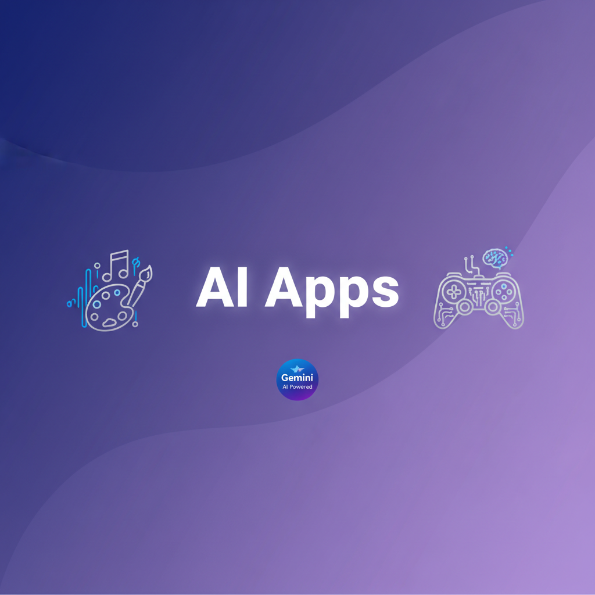

# AI Apps - Gemini 기반 멀티모달 생성 도구

<div align="center">



**Gemini AI를 활용한 게임 오디오 & 아트 생성 플랫폼**

[](https://opensource.org/licenses/MIT)
[](https://nextjs.org/)
[](https://www.typescriptlang.org/)
[](https://vercel.com)

[데모 보기](#) | [문서](./CLAUDE.md) | [배포 가이드](./DEPLOY.md) | [기여하기](./CONTRIBUTING.md)

</div>

---

## 📖 목차

- [소개](#-소개)
- [주요 기능](#-주요-기능)
- [기술 스택](#-기술-스택)
- [시작하기](#-시작하기)
- [사용 방법](#-사용-방법)
- [프로젝트 구조](#-프로젝트-구조)
- [개발](#-개발)
- [배포](#-배포)
- [라이선스](#-라이선스)

---

## 🎯 소개

**AI Apps**는 Google Gemini AI를 활용하여 게임 개발자와 크리에이터를 위한 멀티모달 콘텐츠를 생성하는 웹 애플리케이션입니다.

### 포함된 앱

1. **🎵 AI 게임 오디오 생성기**
   - Gemini Lyria RealTime API 기반
   - 실시간 배경 음악 및 효과음 생성
   - 장르, 분위기, BPM, 악기 커스터마이징

2. **🎨 AI 2D 게임 아트 생성기**
   - Gemini 2.5 Flash Image API 기반
   - 2D 픽셀 아트, 캐릭터, 배경 생성
   - 이미지 편집 및 스타일 전이 지원

---

## ✨ 주요 기능

### 🎵 오디오 생성기

- **프롬프트 빌더**: 장르, 분위기, BPM, 악기, 길이 설정
- **실시간 생성**: WebSocket 스트리밍으로 빠른 생성
- **미리듣기**: 생성 전 프롬프트 미리보기
- **라이브러리 관리**: 태그 필터링, 검색, 다운로드
- **배경 작업 큐**: 여러 오디오 동시 생성

### 🎨 아트 생성기

- **프롬프트 빌더**: 스타일, 주제, 색상 팔레트 선택
- **다양한 종횡비**: 1:1, 16:9, 9:16 등 지원
- **이미지 편집**: 생성된 이미지 수정 기능
- **스타일 전이**: 참조 이미지의 스타일 적용
- **갤러리 관리**: 태그 필터링, 검색, 다운로드

### 🔐 보안 & 개인정보

- **클라이언트 측 API 키 관리**: 서버에 키를 저장하지 않음
- **AES-256-GCM 암호화**: 브라우저 localStorage에 안전하게 저장
- **디바이스 지문 기반**: 각 디바이스별 고유 암호화 키

### 📊 관찰성 & 성능

- **Vercel Speed Insights**: 실시간 성능 모니터링
- **Core Web Vitals**: LCP, CLS, TTFB, INP 추적
- **에러 바운더리**: 사용자 친화적 에러 처리
- **구조화된 로깅**: 서버 측 상세 로그

---

## 🛠️ 기술 스택

### Frontend

- **[Next.js 15](https://nextjs.org/)**: React 프레임워크 (App Router)
- **[TypeScript](https://www.typescriptlang.org/)**: 타입 안전성
- **[Tailwind CSS](https://tailwindcss.com/)**: 유틸리티 우선 스타일링
- **[Zustand](https://github.com/pmndrs/zustand)**: 상태 관리

### AI & API

- **[Gemini Lyria RealTime](https://ai.google.dev/)**: 음악 생성 API
- **[Gemini 2.5 Flash Image](https://ai.google.dev/)**: 이미지 생성 API
- **WebSocket**: 실시간 스트리밍

### 데이터 & 저장소

- **[IndexedDB](https://developer.mozilla.org/en-US/docs/Web/API/IndexedDB_API)**: 클라이언트 측 데이터베이스
- **localStorage**: 작업 큐 및 설정 저장

### 테스트 & 품질

- **[Vitest](https://vitest.dev/)**: 단위/통합 테스트
- **[Playwright](https://playwright.dev/)**: E2E 테스트
- **[ESLint](https://eslint.org/)**: 코드 린팅
- **[Prettier](https://prettier.io/)**: 코드 포맷팅

### 배포 & 모니터링

- **[Vercel](https://vercel.com/)**: 배포 플랫폼
- **[Vercel Analytics](https://vercel.com/analytics)**: 사용자 분석
- **[Vercel Speed Insights](https://vercel.com/docs/speed-insights)**: 성능 모니터링

---

## 🚀 시작하기

### 사전 요구 사항

- **Node.js**: >= 20.0.0
- **npm**: >= 10.0.0
- **Gemini API 키**: [Google AI Studio](https://makersuite.google.com/app/apikey)에서 발급

### 설치

1. **리포지토리 클론**

   ```bash
   git clone https://github.com/devlikebear/aiapps.git
   cd aiapps
   ```

2. **의존성 설치**

   ```bash
   npm install
   ```

3. **개발 서버 실행**

   ```bash
   npm run dev
   ```

4. **브라우저에서 열기**

   [http://localhost:3000](http://localhost:3000)

---

## 📱 사용 방법

### 1. API 키 설정

1. [Google AI Studio](https://makersuite.google.com/app/apikey)에서 Gemini API 키 발급
2. 앱에서 **Settings** 페이지로 이동
3. **API Key Settings** 섹션에 API 키 입력
4. **Save** 버튼 클릭

> **참고**: API 키는 브라우저 localStorage에 AES-256-GCM 암호화되어 저장됩니다. 서버로 전송되지 않습니다.

### 2. 오디오 생성

1. **오디오 생성기** 페이지로 이동
2. **프롬프트 빌더**에서 설정:
   - 장르 선택 (Orchestral, Electronic, Ambient 등)
   - 분위기 선택 (Epic, Calm, Suspense 등)
   - BPM 설정 (60-200)
   - 악기 선택
   - 길이 설정 (초 단위)
3. **Generate** 버튼 클릭
4. 생성 완료 후:
   - 미리듣기
   - 다운로드 (.wav)
   - 라이브러리에 저장

### 3. 아트 생성

1. **아트 생성기** 페이지로 이동
2. **프롬프트 빌더**에서 설정:
   - 스타일 선택 (Pixel Art, Cartoon, Realistic 등)
   - 주제 선택 (Character, Background, Item 등)
   - 색상 팔레트 선택
   - 종횡비 선택 (1:1, 16:9, 9:16 등)
   - 프롬프트 입력
3. **Generate** 버튼 클릭
4. 생성 완료 후:
   - 이미지 미리보기
   - 다운로드 (.png)
   - 편집 또는 스타일 전이
   - 갤러리에 저장

### 4. 미디어 라이브러리

- **필터링**: 태그, 미디어 타입별 필터
- **검색**: 프롬프트 기반 검색
- **정렬**: 날짜, 이름순 정렬
- **일괄 작업**: 여러 미디어 선택 후 다운로드/삭제

---

## 📁 프로젝트 구조

```
aiapps/
├── app/                          # Next.js App Router
│   ├── apps/
│   │   ├── audio-generator/      # 오디오 생성기 페이지
│   │   └── art-generator/        # 아트 생성기 페이지
│   ├── api/                      # API Routes
│   │   ├── audio/                # 오디오 생성 API
│   │   ├── art/                  # 아트 생성 API
│   │   └── settings/             # 설정 API
│   ├── settings/                 # 설정 페이지
│   ├── library/                  # 통합 미디어 라이브러리
│   ├── components/               # React 컴포넌트
│   ├── lib/                      # 유틸리티, 스토어, DB
│   │   ├── api-key/              # API 키 암호화
│   │   ├── db/                   # IndexedDB 관리
│   │   ├── monitoring/           # 성능 모니터링
│   │   ├── queue/                # 배경 작업 큐
│   │   └── stores/               # Zustand 스토어
│   └── layout.tsx                # 루트 레이아웃
├── e2e/                          # E2E 테스트 (Playwright)
├── public/                       # 정적 파일
├── .github/                      # GitHub 설정
├── CLAUDE.md                     # 개발자 가이드
├── DEPLOY.md                     # 배포 가이드
├── PLAN.md                       # 프로젝트 계획
└── package.json
```

---

## 💻 개발

### 개발 명령어

```bash
# 개발 서버 실행
npm run dev

# 프로덕션 빌드
npm run build

# 프로덕션 서버 실행
npm run start

# 린트 검사
npm run lint

# 린트 자동 수정
npm run lint:fix

# 타입 체크
npm run type-check

# 단위/통합 테스트
npm run test

# E2E 테스트
npm run test:e2e

# 번들 분석
npm run analyze

# 코드 포맷팅
npm run format
```

### 환경 변수

개발 환경에서는 환경 변수가 필요하지 않습니다. API 키는 클라이언트 측에서 관리됩니다.

프로덕션 배포 시 필요한 환경 변수는 [DEPLOY.md](./DEPLOY.md)를 참고하세요.

### 코딩 규칙

- **TypeScript**: strict mode 사용
- **ESLint**: `npm run lint`로 검사
- **Prettier**: `npm run format`으로 포맷팅
- **Commit**: Conventional Commits 규칙 준수

```bash
# 예시
feat(audio): add new genre options
fix(api): handle rate limit errors
docs(readme): update installation steps
```

---

## 🚀 배포

### Vercel 배포 (권장)

자세한 배포 가이드는 [DEPLOY.md](./DEPLOY.md)를 참고하세요.

**간단한 배포 방법**:

1. [Vercel](https://vercel.com)에 GitHub 계정으로 로그인
2. **New Project** 클릭
3. `aiapps` 리포지토리 선택
4. **Deploy** 클릭

배포 후 사용자에게 Settings 페이지에서 API 키를 입력하도록 안내하세요.

### 자체 호스팅

```bash
# 프로덕션 빌드
npm run build

# 프로덕션 서버 실행
npm run start
```

---

## 🧪 테스트

### E2E 테스트

```bash
# E2E 테스트 실행
npm run test:e2e

# UI 모드로 실행
npx playwright test --ui

# 특정 브라우저만 테스트
npx playwright test --project=chromium
```

자세한 테스트 가이드는 [e2e/README.md](./e2e/README.md)를 참고하세요.

---

## 🤝 기여하기

기여를 환영합니다! 자세한 내용은 [CONTRIBUTING.md](./CONTRIBUTING.md)를 참고하세요.

### 기여 절차

1. 리포지토리 포크
2. 피처 브랜치 생성 (`git checkout -b feature/amazing-feature`)
3. 변경사항 커밋 (`git commit -m 'feat: add amazing feature'`)
4. 브랜치 푸시 (`git push origin feature/amazing-feature`)
5. Pull Request 생성

---

## 📄 라이선스

이 프로젝트는 MIT 라이선스 하에 배포됩니다. 자세한 내용은 [LICENSE](./LICENSE) 파일을 참고하세요.

---

## 🙏 감사의 말

- [Google Gemini AI](https://ai.google.dev/) - AI 모델 제공
- [Vercel](https://vercel.com/) - 배포 플랫폼
- [Next.js](https://nextjs.org/) - React 프레임워크
- 모든 오픈소스 기여자들

---

## 📞 문의

- **이슈**: [GitHub Issues](https://github.com/devlikebear/aiapps/issues)
- **이메일**: devlikebear@gmail.com
- **문서**: [프로젝트 문서](./CLAUDE.md)

---

<div align="center">

**Made with ❤️ by [devlikebear](https://github.com/devlikebear)**

[⬆ 맨 위로](#ai-apps---gemini-기반-멀티모달-생성-도구)

</div>
